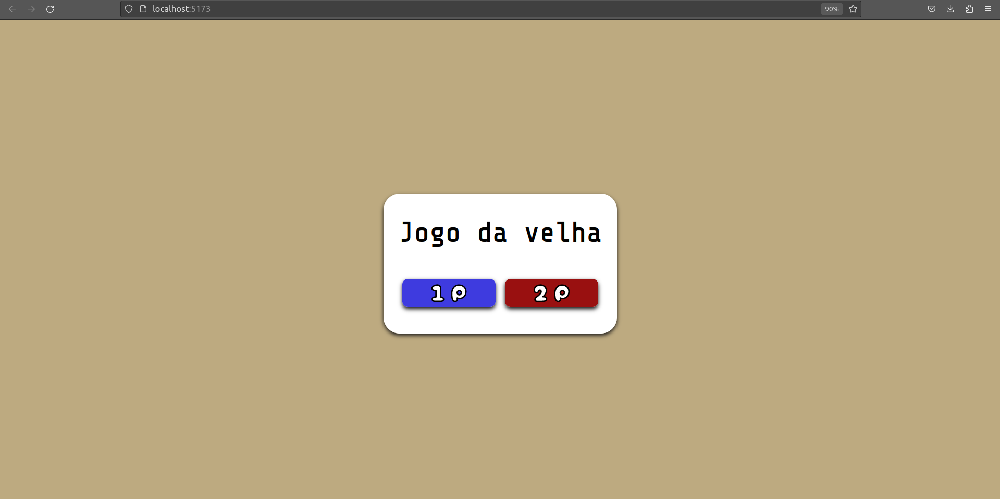

# 4 - TicTacToe

A React and TypeScript made TicTacToe game. This one was the most difficult until now. It works fine and have some nice features included:

- You can choose if starts with **O** or **X**
- You can play in two modes:
    - One player (1P): You play against the machine - the program choose a random empty square to fill.
    - Two players (2P): You can play with a friend!

### You can play by yourself, running:

```bash
cd infojr-nucleo-web/4-tictactoe/Jogo\ da\ Velha/
npm install
npm run dev
```

Then, access [http://localhost:5173/](http://localhost:5173/).

### Menu component



Translate:

TicTacToe

### TicTacToe component


Translate: 

Who start?

Restart

### Table component and Square components


---


Translate: 

Winner: X
