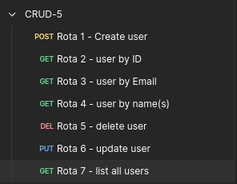

# 5 - CRUD

Now, I made a simple REST API, using Express.js with TypeScript, Prisma as ORM and SQLite as my Database.

This CRUD has a unique model (User):

```sql
model User {
  id    Int     @id @default(autoincrement())
  email String  @unique
  name  String
  age   Int
  state String
  city  String
  created_at  DateTime @default(now())
}
```

And it has 7 possible routes:



1. Creating user:


1. Getting user by ID:


1. Getting user by Email:


1. Getting user by name(s):
    
    Here I can get one or more names separated by comma.
    


1. Deleting user by ID:


1. Updating user by ID:


1. Listing all users:


### You can test it by yourself, running:

```bash
cd 5-CRUD
rm -r prisma/migrations/ prisma/dev.db
npx prisma migrate dev migration init # Give a name to migration
npm run dev
```