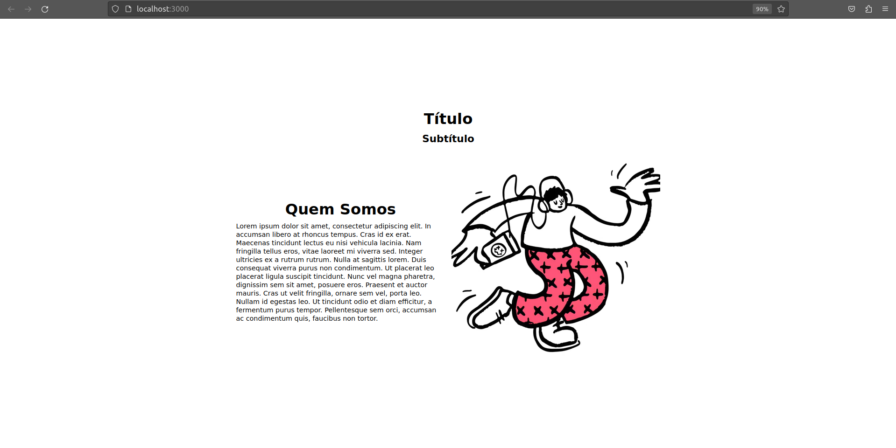

# 6 - Prismic

Here the mission was to do a simple page using the CMS Prismic, with two sections. So I used two slices on Prismic.

Furthermore, I used NextJs and TypeScript for that.

### To run this page:

```bash
cd 6-prismic/caio-page/
npm run dev
```

Then, open [http://localhost:3000/](http://localhost:3000/).

