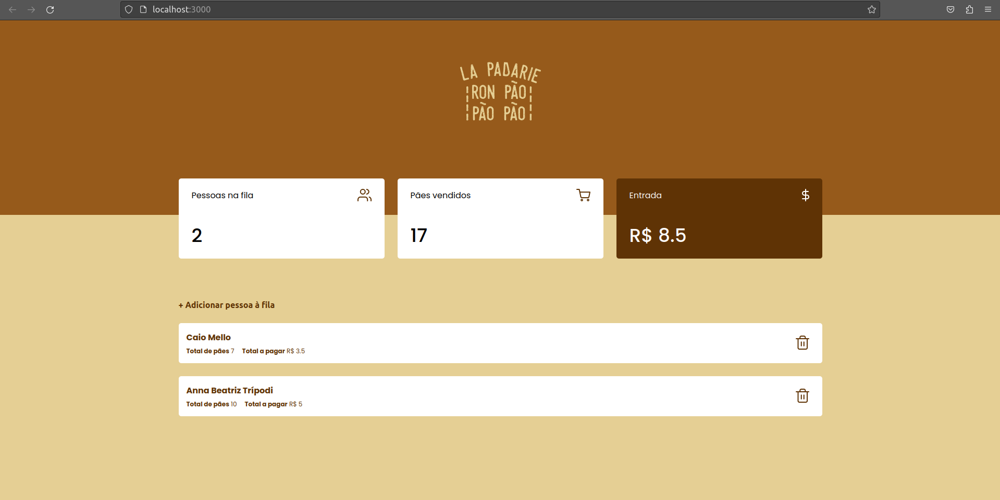

# 7 - La Padarie

Here I made a complete website using NextJs and TypeScript.

It's a bakery website, where customers will queue and place their order, defining their name and the amount of bread.

Every bread costs R$ 0,50. All customers are listed on menu, and the amount of money and breads sold on the top. 

The costumer is a model on the database, and have 4 routes, all of them accessible by buttons on the front-end.

The front-end is completely responsive and I used the Next API for the back-end, with Prisma as ORM and SQLite as database.

### To try it by yourself, run this:

```bash
cd 7-LaPadarie/la-padarie-caio-arthur-rafael
rm -r prisma/migrations prisma/dev.db
npx prisma migrate dev migration init # Give a name to migration
npm run start-api
```

In other terminal, run:

```bash
cd 7-LaPadarie/la-padarie-caio-arthur-rafael
npm run dev
```

Then, access [http://localhost:3000/](http://localhost:3000/).




